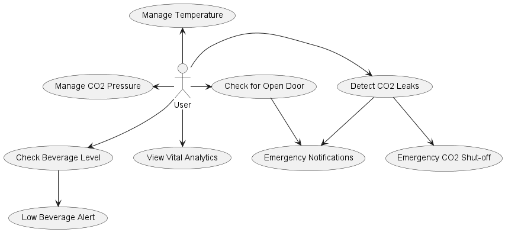
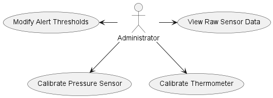

# Smart Beverage Dispensing System

**ESP32-Powered Control System for Precision Beverage Dispensing**

## Overview

This project is a precision beverage dispensing control system, developed using ESP32 and ESP-IDF. Inspired by our DIY Beverage Fridge, this system addresses key issues in pressurized beverage dispensing, including CO2 leakage, pressure management, and temperature control. Through remote monitoring and control, it enables users to manage dispensing variables directly via a user-friendly web interface.

## Features

### Standard User Interactions
- **CO2 Monitoring**: Detects CO2 levels and sends alerts when levels exceed safe thresholds.
- **Pressure and Temperature Management**: Remotely adjust CO2 pressure and internal temperature to maintain optimal beverage conditions.
- **Leak Detection**: Monitors CO2 concentration for potential leaks and initiates emergency CO2 shut-off if necessary.
- **Door Status and Beverage Level**: Detects if the fridge door is left open and estimates beverage levels, alerting users when the keg is low.

### Advanced User Interactions (Admin Access)
- **Threshold Customization**: Allows administrators to adjust emergency alert thresholds.
- **Sensor Calibration**: Provides tools for precise sensor calibration, including pressure and temperature sensors.
- **Raw Data Access**: Enables in-depth analysis by offering access to unprocessed sensor data.

## System Architecture

The Smart Beverage Dispensing System combines hardware and software to manage and control dispensing variables in real time. 

Key Components:
- **ESP32 Microcontroller**: Manages sensor data acquisition, alerting, and controls.
- **Sensors**: Monitors CO2, pressure, and temperature.
- **Web Interface**: Accessible via computers and smartphones for remote management of dispensing parameters.

## Development Tools

This project was developed using:
- **ESP-IDF (Espressif IoT Development Framework)** for managing ESP32 functionality.
- **VSCode** as the primary IDE for firmware development.

## Diagrams

### System and User Interaction Diagrams
All UML diagrams were created using **PlantUML** to visualize system structure and user interactions.

- **Standard User Use Case**: 
- **Admin User Use Case**: 
